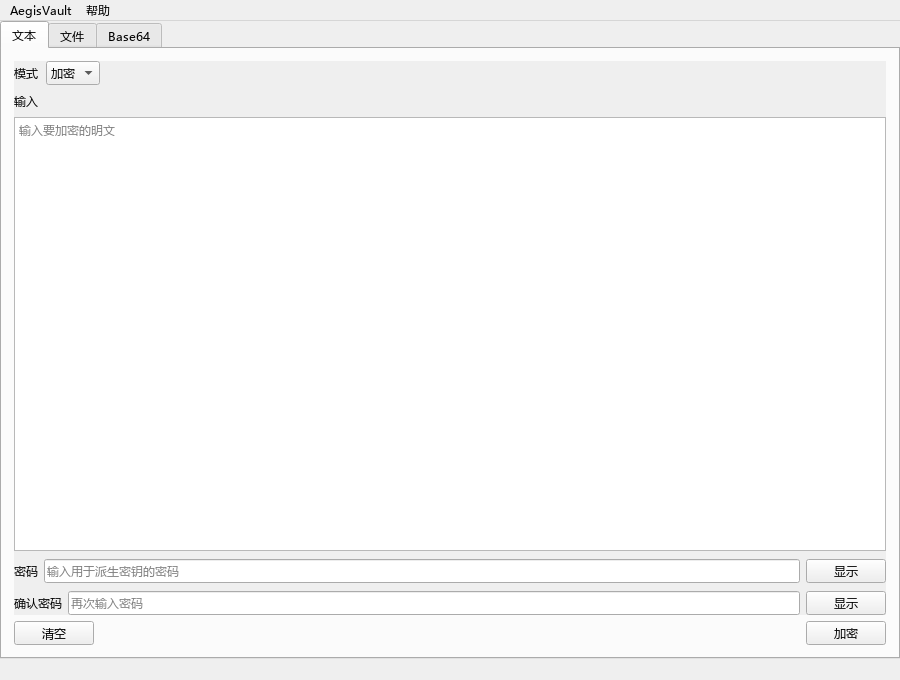

# AegisVault

AegisVault 1.0.0 is a local Windows desktop utility for encrypting text and files in the AGV1 format. It also includes Base64 encode/decode workflows. Old AES and AK formats are not supported.

The app is offline and local-first. It does not add accounts, cloud sync, telemetry, network features or enterprise key management.

## Who It Is For

AegisVault is intended for users who need a straightforward desktop tool to encrypt local text snippets or files with a password before storing or sharing them. It is not a password manager, endpoint security product or replacement for full-disk encryption.

## Downloads

Download the workflow-built assets from the [GitHub Release](https://github.com/Qrzzzz/AegisVaultWindows/releases/tag/v1.0.0):

- `AegisVault-v1.0.0-win64.zip`
- `AegisVault-v1.0.0.cdx.json` (software bill of materials)
- `SHA256SUMS`

Extract the ZIP and run `AegisVault.exe`.

The repository's `release/` directory contains historical binaries and is not the current download source. This release is not Authenticode-signed; verify the checksums and GitHub build provenance before running it.

## Features

- Text encryption and decryption with `AGV1.` tokens.
- File encryption and decryption with chunked `.agv` containers.
- AES-256-GCM encryption with scrypt password-based key derivation for new data.
- Base64 text and file encode/decode. Base64 is encoding, not encryption.
- Fixed basic light Qt UI, with settings for language, output directory, overwrite behavior and recent files.
- AGV1-only decryption; no legacy recovery, AK parsing or compatibility switch.
- Atomic output writes for file workflows.

## Security Model

New encryption uses AES-256-GCM and scrypt with random salt. Text tokens authenticate their protocol header as AAD. File encryption is chunked, and each chunk authenticates the header hash, chunk index and final-chunk flag.

AegisVault data is locally encrypted with documented design and tests, but not independently audited.

AegisVault does not protect against malware, clipboard monitoring, screen recording, screenshots, weak or reused passwords, compromised backups, physical access to an unlocked machine, plaintext copied elsewhere, or users losing the password. Filenames and filesystem metadata may still reveal sensitive context.

More detail:

- `docs/SECURITY_MODEL.md`
- `docs/PROTOCOL.md`
- `docs/MIGRATION.md`

## Install From Source

```powershell
python -m venv .venv
.\scripts\install_locked_dependencies.ps1
```

## Run

```powershell
.\.venv\Scripts\python.exe -m aegisvault
```

The package also installs the console script:

```powershell
.\.venv\Scripts\aegisvault.exe
```

For CI/headless smoke tests:

```powershell
$env:AEGISVAULT_HEADLESS_SMOKE="1"
.\.venv\Scripts\python.exe -m aegisvault
```

## Build A Windows Release

```powershell
.\scripts\verify_release.ps1 -Build -Zip -InstallDependencies
```

The expected artifact is:

```text
dist\AegisVault-v1.0.0-win64.zip
```

The ZIP contains `AegisVault.exe`.

## Quality Checks

```powershell
.\.venv\Scripts\python.exe -m compileall src tests
.\.venv\Scripts\python.exe -m ruff check .
.\.venv\Scripts\python.exe -m mypy src
.\.venv\Scripts\python.exe -m pytest -vv --cov=aegisvault --cov-report=term-missing --cov-report=xml:coverage.xml --cov-fail-under=70
$env:AEGISVAULT_HEADLESS_SMOKE="1"; .\.venv\Scripts\python.exe -m aegisvault
.\scripts\verify_release.ps1 -Build -Zip
```

## Screenshots



[File workspace](docs/screenshots/minimal-file-zh-CN.png) · [Base64 workspace](docs/screenshots/minimal-base64-zh-CN.png) · [Settings](docs/screenshots/basic-settings.png)

## Project Structure

```text
src/aegisvault/
  core/       AGV1 cryptography, KDF, protocol, low-level file primitives
  services/   workflow facade, output naming, recent files
  settings/   persistent settings
  ui/         PySide6 pages, dialogs, components and task controller
  resources/  icon and legacy packaged QSS (not loaded by the UI)
scripts/      build and release verification scripts
docs/         security, protocol, format support, QA and release notes
tests/        unit, integration, source-health and release-consistency tests
```

## License

MIT. See `LICENSE`.
